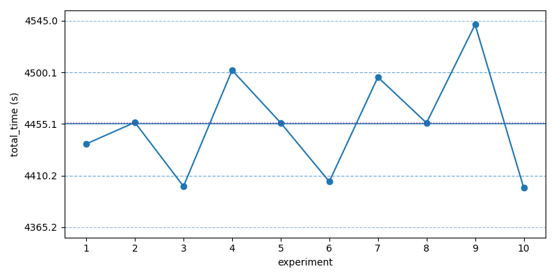
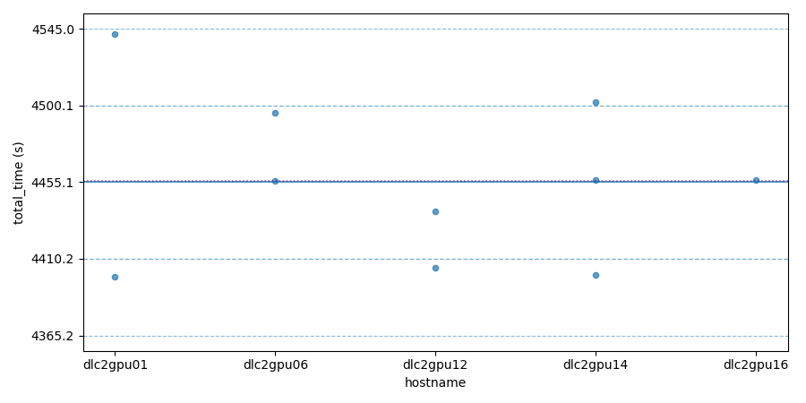

# Baseline

Baseline was obtained by averaging 10 runs across the cluster. Only one run's log is included here for reference.

## Runs

| experiment_id          | hostname  | total_time | in_mins |
|------------------------|-----------|------------|---------|
| 260131-174351-6457d9b3 | dlc2gpu01 | 4399.57s   | 73.33m  |
| 260131-060945-077cd1f7 | dlc2gpu14 | 4400.78s   | 73.35m  |
| 260131-064352-968877f5 | dlc2gpu12 | 4404.92s   | 73.42m  |
| 260131-050507-4f5e023b | dlc2gpu12 | 4437.75s   | 73.96m  |
| 260131-131258-5de1b7c5 | dlc2gpu06 | 4456.02s   | 74.27m  |
| 260131-061903-260a7d0f | dlc2gpu16 | 4456.11s   | 74.27m  |
| 260131-055813-dd967ff5 | dlc2gpu14 | 4456.49s   | 74.27m  |
| 260131-131258-54de6af9 | dlc2gpu06 | 4495.87s   | 74.93m  |
| 260131-061123-49a06028 | dlc2gpu14 | 4501.90s   | 75.03m  |
| 260131-174351-5d34b53f | dlc2gpu01 | 4541.68s   | 75.69m  |

## Statistics

- Mean: 4455.11 s
- Standard deviation: 44.95 s
- Median: 4456.07 s

## Plots

The blue line denotes the mean across the 10 runs, the dashed lines indicate ±1 and ±2 standard deviations. The purple dotted line denotes the median.

