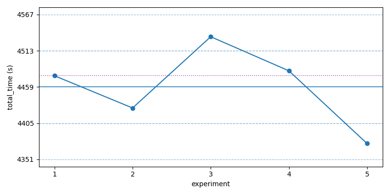
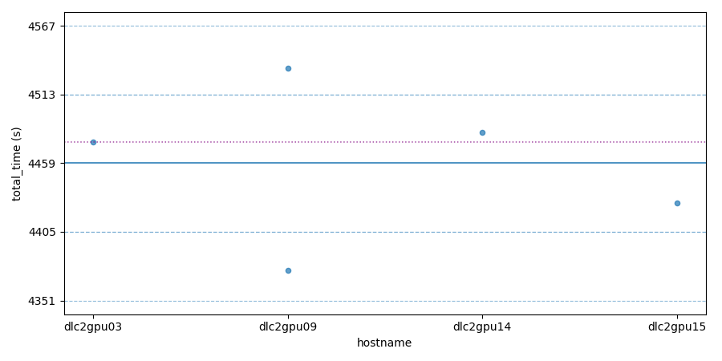

# Baseline

Baseline was obtained by averaging 5 runs across the cluster. Only one run's log is included here for reference.

```
#  experiment_id                    hostname   total_time  in_mins  roc_auc   epoch  μ_epoch_t  datasets
-  -------------------------------  ---------  ----------  -------  --------  -----  ---------  --------
1  260205-223919-fad38238-baseline  dlc2gpu03  4475.83s    74.60m   0.806861  1259   3.56s      80576
2  260205-224029-0623835f-baseline  dlc2gpu15  4427.70s    73.80m   0.806861  1259   3.52s      80576
3  260205-224029-1a8e142d-baseline  dlc2gpu09  4534.00s    75.57m   0.806861  1259   3.60s      80576
4  260205-224029-9fbc2550-baseline  dlc2gpu14  4483.19s    74.72m   0.806861  1259   3.56s      80576
5  260205-224029-fdfe9f9f-baseline  dlc2gpu09  4374.70s    72.91m   0.806861  1259   3.47s      80576

stats: mean: 4459.08s (74.32m) std: 54.00s median: 4475.83s (74.60m)
```


## Plots

The blue line denotes the mean across the 10 runs, the dashed lines indicate ±1 and ±2 standard deviations. The purple dotted line denotes the median.



