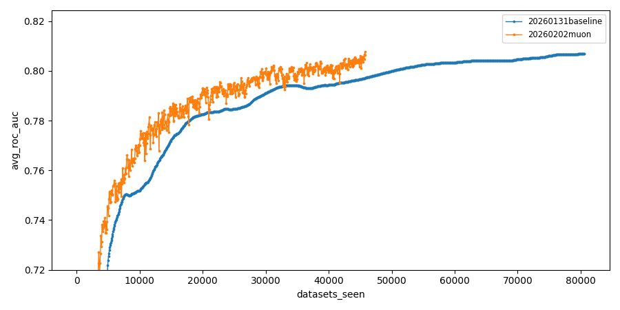
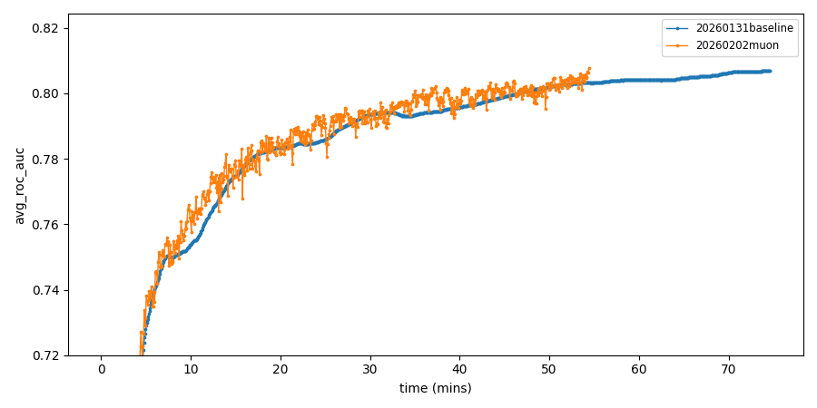

# Muon

This record was obtained by implementing the Muon optimizer.

[[writeup](https://kellerjordan.github.io/posts/muon/)] -
[[extra writing](https://jeremybernste.in/writing/deriving-muon)] - 
[[repo](https://github.com/KellerJordan/Muon)] -
[[source record log](https://github.com/KellerJordan/modded-nanogpt/blob/master/records/track_1_short/2024-10-10_Muon/eb5659d0-fb6a-49e5-a311-f1f89412f726.txt)]

Only one run's log is included here for reference. The median run is the one added to the general record table.


```
#  experiment_id                hostname   total_time  in_mins  roc_auc   epoch  μ_epoch_t  datasets
-  ---------------------------  ---------  ----------  -------  --------  -----  ---------  --------
1  260205-224049-50405f6e-muon  dlc2gpu15  3299.03s    54.98m   0.807814  716    4.61s      45824
2  260205-224054-32eb381a-muon  dlc2gpu03  3261.69s    54.36m   0.807814  716    4.56s      45824
3  260205-224054-582e18e2-muon  dlc2gpu08  3246.90s    54.12m   0.807814  716    4.53s      45824
4  260205-224100-117c1dc1-muon  dlc2gpu08  3273.00s    54.55m   0.807814  716    4.57s      45824
5  260205-224113-34e556ea-muon  dlc2gpu08  3264.89s    54.41m   0.807814  716    4.56s      45824

stats: mean: 3269.10s (54.49m) std: 17.18s median: 3264.89s (54.41m)
```

## Plots



