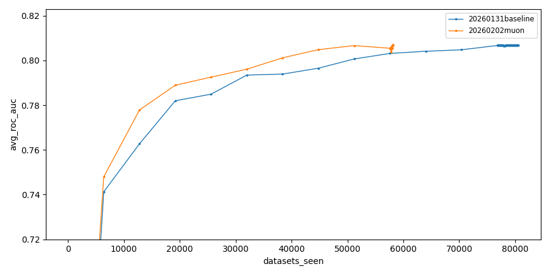
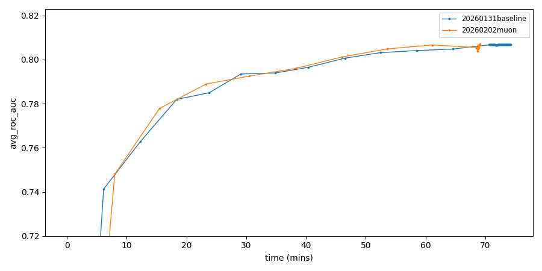

# Muon

This record was obtained by implementing the Muon optimizer.

[[writeup](https://kellerjordan.github.io/posts/muon/)] -
[[repo](https://github.com/KellerJordan/Muon)] -
[[source record log](https://github.com/KellerJordan/modded-nanogpt/blob/master/records/track_1_short/2024-10-10_Muon/eb5659d0-fb6a-49e5-a311-f1f89412f726.txt)]

Only one run's log is included here for reference. The median run is the one added to the general record table.

## Runs

| experiment_id          | hostname  | total_time | in_mins |
|------------------------|-----------|------------|---------|
| 260202-000029-00405a29 | dlc2gpu01 | 4170.85s   | 69.51m  |
| 260202-000029-41eba9e8 | dlc2gpu01 | 4149.11s   | 69.15m  |
| 260202-000029-d1dc95ff | dlc2gpu02 | 4102.73s   | 68.38m  |

## Statistics

- Mean: 4140.90 s
- Standard deviation: 28.41 s
- Median: 4149.11 s

## Plots

