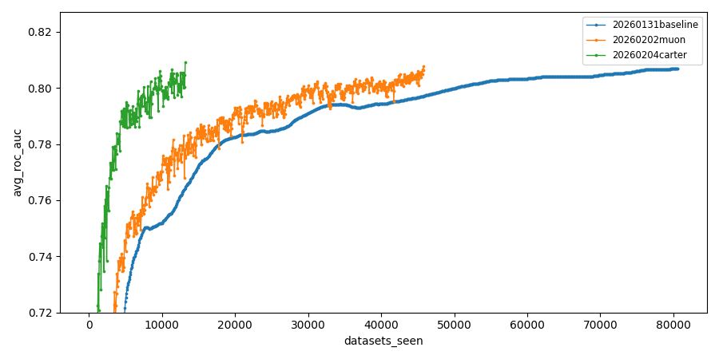
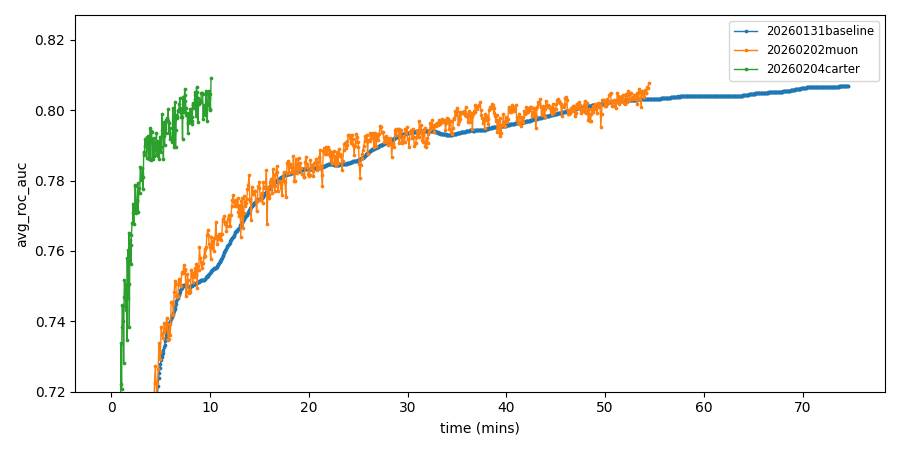

# PR ([#2](https://github.com/borawhocodess/modded-nanotabpfn/pull/2))

Only one run's log is included here for reference. The median run is the one added to the general record table.

```
#  experiment_id                  hostname   total_time  in_mins  roc_auc   epoch  μ_epoch_t  datasets
-  -----------------------------  ---------  ----------  -------  --------  -----  ---------  --------
1  260205-225948-e452851f-carter  dlc2gpu03  542.34s     9.04m    0.807031  206    2.63s      13184
2  260205-225951-d60000eb-carter  dlc2gpu09  606.25s     10.10m   0.809095  206    2.94s      13184
3  260205-230001-2a48a187-carter  dlc2gpu11  659.57s     10.99m   0.807605  239    2.76s      15296
4  260205-230002-7e1ea7a1-carter  dlc2gpu12  562.82s     9.38m    0.808042  209    2.69s      13376
5  260205-230004-a4f2c2f5-carter  dlc2gpu01  798.23s     13.30m   0.807989  306    2.61s      19584

stats: mean: 633.84s (10.56m) std: 91.50s median: 606.25s (10.10m)
```


## Ablation Study

I ran 5 trials per knob in both directions:
- adding the change to the Muon baseline record
- removing the change from the Carter record

Records:
- muon stats: mean: 3269.10s (54.49m) std: 17.18s median: 3264.89s (54.41m)
- carter stats: mean: 633.84s (10.56m) std: 91.50s median: 606.25s (10.10m)

Adding each change to the Muon record:

| knob | muon + knob | mean std median |
| --- | --- | --- |
| `lr`                      | `-42%` | mean: 1895.20s (31.59m) std: 9.36s median: 1891.07s (31.52m) |
| `(a,e)`                   | `-16%` | mean: 2754.81s (45.91m) std: 21.15s median: 2746.83s (45.78m) |
| `explicit_qkv_sdpa`       | `-28%` | mean: 2325.66s (38.76m) std: 88.83s median: 2339.66s (38.99m) |
| `autocast_train`          | `-9%`  | mean: 2995.61s (49.93m) std: 91.99s median: 2958.64s (49.31m) |
| `autocast_eval`           | `-10%` | mean: 3048.20s (50.80m) std: 222.61s median: 2947.95s (49.13m) |
| `matmul_precision_high`   | `-17%` | mean: 2702.41s (45.04m) std: 17.00s median: 2703.66s (45.06m) |

Removing each knob from the Carter record:

| knob | carter - knob | mean std median |
| --- | --- | --- |
| `lr`                      | `+223%` | mean: 1969.49s (32.82m) std: 66.19s median: 1957.42s (32.62m) |
| `(a,e)`                   | `+53%`  | mean: 941.07s (15.68m) std: 133.20s median: 929.55s (15.49m) |
| `explicit_qkv_sdpa`       | `+121%` | mean: 1331.03s (22.18m) std: 16.50s median: 1337.61s (22.29m) |
| `autocast_train`          | `+4%`   | mean: 668.90s (11.15m) std: 105.61s median: 632.75s (10.55m) |
| `autocast_eval`           | `-12%`  | mean: 563.41s (9.39m) std: 93.06s median: 532.25s (8.87m) |
| `matmul_precision_high`   | `-6%`   | mean: 593.92s (9.90m) std: 57.34s median: 569.43s (9.49m) |

Percentage comparisons are based on median times and rounded to whole numbers (no decimals).

## Plots



