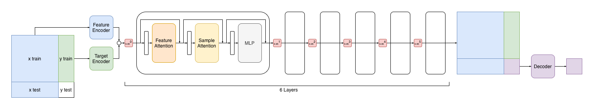

# Residual Decay



Only one run's log is included here for reference. The median run is the one added to the general record table.

```
##  #   experiment_id                    hostname   total_time  in_mins  roc_auc   epoch  μ_epoch_t  datasets
--  --  -------------------------------  ---------  ----------  -------  --------  -----  ---------  --------
1   27  260311-154259-9fcfcbb7-new2-s11  dlc2gpu09  356.08s     5.93m    0.806860  126    2.83s      8064    
2   14  260311-154251-76f25a24-new2-s11  dlc2gpu17  368.55s     6.14m    0.807486  126    2.93s      8064    
3   9   260310-024152-6a6d610f-new2-s11  dlc2gpu02  369.78s     6.16m    0.807043  126    2.93s      8064    
4   3   260310-021709-025fde5b-new2-s11  dlc2gpu01  383.68s     6.39m    0.806982  139    2.76s      8896    
5   8   260310-022845-d0387e29-new2-s11  dlc2gpu02  385.28s     6.42m    0.807365  178    2.16s      11392   
6   19  260311-154253-6a5558bf-new2-s11  dlc2gpu16  385.95s     6.43m    0.807004  138    2.80s      8832    
7   18  260311-154253-15518150-new2-s11  dlc2gpu16  390.12s     6.50m    0.807858  139    2.81s      8896    
8   25  260311-154258-e53e99c6-new2-s11  dlc2gpu09  400.81s     6.68m    0.808903  142    2.82s      9088    
9   11  260311-154251-2945a8ff-new2-s11  dlc2gpu17  402.36s     6.71m    0.806978  142    2.83s      9088    
10  26  260311-154259-6d70db82-new2-s11  dlc2gpu08  404.51s     6.74m    0.806880  147    2.75s      9408    
11  1   260310-015102-ac58d6c4-new2-s11  dlc2gpu03  407.67s     6.79m    0.806877  142    2.87s      9088    
12  29  260311-154259-dd4a1df0-new2-s11  dlc2gpu08  410.11s     6.84m    0.807495  147    2.79s      9408    
13  17  260311-154252-b40ca92a-new2-s11  dlc2gpu17  416.91s     6.95m    0.806865  149    2.80s      9536    
14  6   260310-022037-eda6d44f-new2-s11  dlc2gpu01  420.91s     7.02m    0.809092  157    2.68s      10048   
15  16  260311-154251-b11a20a1-new2-s11  dlc2gpu07  431.08s     7.18m    0.807047  152    2.84s      9728    
16  20  260311-154253-a787618f-new2-s11  dlc2gpu16  454.12s     7.57m    0.808967  175    2.59s      11200   
17  13  260311-154251-51c419de-new2-s11  dlc2gpu07  462.45s     7.71m    0.806994  175    2.64s      11200   
18  5   260310-021839-e8ed47f9-new2-s11  dlc2gpu03  466.06s     7.77m    0.807612  170    2.74s      10880   
19  21  260311-154254-19816e9c-new2-s11  dlc2gpu07  467.71s     7.80m    0.808167  178    2.63s      11392   
20  23  260311-154258-5bc033ec-new2-s11  dlc2gpu09  469.70s     7.83m    0.807437  177    2.65s      11328   
21  4   260310-021741-67aedfe7-new2-s11  dlc2gpu04  471.34s     7.86m    0.808003  172    2.74s      11008   
22  12  260311-154251-371c392f-new2-s11  dlc2gpu07  471.39s     7.86m    0.809256  172    2.74s      11008   
23  22  260311-154258-1107b5f4-new2-s11  dlc2gpu09  473.04s     7.88m    0.807799  178    2.66s      11392   
24  15  260311-154251-895d6c16-new2-s11  dlc2gpu17  479.34s     7.99m    0.806951  185    2.59s      11840   
25  10  260310-024346-ffbadb38-new2-s11  dlc2gpu01  485.86s     8.10m    0.806891  181    2.68s      11584   
26  7   260310-022551-a084da86-new2-s11  dlc2gpu03  511.07s     8.52m    0.807301  189    2.70s      12096   
27  30  260311-161030-d0c28055-new2-s11  dlc2gpu16  528.15s     8.80m    0.807724  206    2.56s      13184   
28  28  260311-154259-c0035b59-new2-s11  dlc2gpu08  531.39s     8.86m    0.807219  209    2.54s      13376   
29  24  260311-154258-7e973e45-new2-s11  dlc2gpu08  538.02s     8.97m    0.807243  207    2.60s      13248   
30  31  260316-114825-045f6dfa-new2-s11  dlc2gpu12  539.38s     8.99m    0.807643  147    3.67s      9408    
31  2   260310-020202-9f21f9fc-new2-s11  dlc2gpu02  545.97s     9.10m    0.807476  206    2.65s      13184   

                                                    446.09s     7.43m    0.807530  164    2.74s      10482   
                                                    55.72s      0.93m    0.000687  25     0.22s      1581    
                                                    454.12s     7.57m    0.807365  170    2.74s      10880   
```
