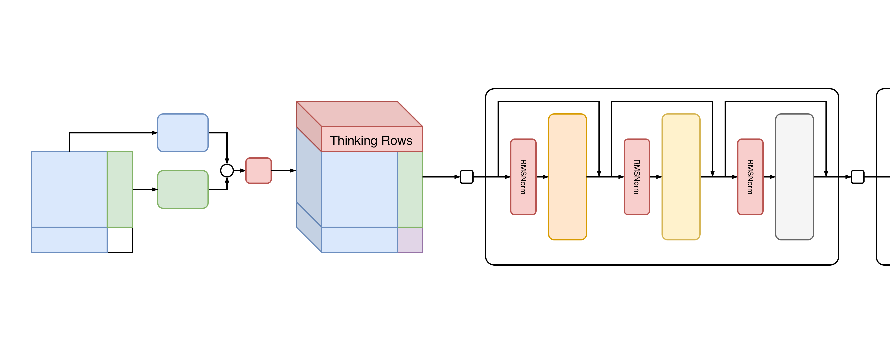

# RMSNorm and ThinkingRows



Combines changes inspired from [TabPFN v2.6](https://github.com/PriorLabs/TabPFN/blob/7b1153a66161e73f6457da5c92af602eabeda87a/src/tabpfn/architectures/tabpfn_v2_6.py) release file:

- **LowerPrecisionRMSNorm**: replace all three LayerNorms with RMSNorm that skips the FP32 autocast upcast
- **ThinkingRows**: prepend 16 learnable row tokens (hyperparameter selection is not optimized)

Only one run's log is included here for reference. The median run is the one added to the general record table.

```
mean               4.05m    155    1.57s      9903      27.74m
std                0.68m    26     0.08s      1683      4.69m
median             3.88m    150    1.54s      9600      27.06m
-----------------  -------  -----  ---------  --------  -------  -----------------
##  #   hostname   in mins  epoch  μ epoch t  datasets  runtime  id-name
--  --  ---------  -------  -----  ---------  --------  -------  -----------------
1   10  dlc2gpu01  2.79m    106    1.58s      6784      19.23m   be287560-rmsthink
2   2   dlc2gpu09  2.95m    112    1.58s      7168      20.32m   29ee6de1-rmsthink
3   22  dlc2gpu01  3.31m    131    1.52s      8384      22.81m   3d229f2f-rmsthink
4   12  dlc2gpu01  3.40m    132    1.55s      8448      23.84m   d6821e76-rmsthink
5   21  dlc2gpu12  3.43m    132    1.56s      8448      22.91m   53d27649-rmsthink
6   3   dlc2gpu12  3.61m    132    1.64s      8448      23.76m   2d8d5634-rmsthink
7   13  dlc2gpu15  3.71m    147    1.52s      9408      26.96m   db6e47e3-rmsthink
8   15  dlc2gpu01  3.72m    147    1.52s      9408      26.48m   fe4d419a-rmsthink
9   6   dlc2gpu09  3.78m    150    1.51s      9600      27.06m   658db410-rmsthink
10  16  dlc2gpu09  3.82m    152    1.51s      9728      27.40m   efc77783-rmsthink
11  23  dlc2gpu05  3.82m    147    1.56s      9408      25.36m   3172e09d-rmsthink
12  4   dlc2gpu15  3.88m    151    1.54s      9664      27.68m   4ba701de-rmsthink
13  19  dlc2gpu01  3.94m    140    1.69s      8960      24.84m   4e15c8b9-rmsthink
14  18  dlc2gpu05  4.07m    132    1.85s      8448      23.82m   b790e3ee-rmsthink
15  14  dlc2gpu15  4.28m    172    1.49s      11008     31.35m   ec6d2459-rmsthink
16  8   dlc2gpu15  4.34m    172    1.51s      11008     31.25m   96586d9a-rmsthink
17  5   dlc2gpu15  4.49m    178    1.51s      11392     32.36m   63d31a14-rmsthink
18  9   dlc2gpu09  4.52m    178    1.52s      11392     31.88m   b296aa8c-rmsthink
19  1   dlc2gpu12  4.75m    176    1.62s      11264     31.54m   0e25ea72-rmsthink
20  7   dlc2gpu01  4.82m    188    1.54s      12032     33.62m   887eee2d-rmsthink
21  11  dlc2gpu15  5.02m    200    1.51s      12800     36.08m   c9c59414-rmsthink
22  17  dlc2gpu03  5.04m    175    1.73s      11200     31.11m   251a4a1a-rmsthink
23  20  dlc2gpu09  5.61m    209    1.61s      13376     36.30m   24dba3e7-rmsthink
```


## Individual Contributions

Each technique was tested independently before combining. ThinkingRows is the driver of the combined improvement.

### ThinkingRows

```
mean              4.10m    158    1.55s      10133     28.49m                     
std               0.35m    15     0.03s      932       2.40m                      
median            4.22m    161    1.55s      10304     29.20m                     
----------------  -------  -----  ---------  --------  -------  ------------------
##  #  hostname   in mins  epoch  μ epoch t  datasets  runtime  id-name           
--  -  ---------  -------  -----  ---------  --------  -------  ------------------
1   5  dlc2gpu06  3.60m    139    1.55s      8896      25.50m   27a10da4-thinkrows
2   7  dlc2gpu06  3.68m    140    1.58s      8960      25.71m   915db5ac-thinkrows
3   1  dlc2gpu01  3.81m    147    1.55s      9408      26.40m   788facc8-thinkrows
4   6  dlc2gpu01  3.83m    147    1.56s      9408      26.34m   7c4a56f0-thinkrows
5   9  dlc2gpu01  4.22m    164    1.54s      10496     29.20m   e0b4fb61-thinkrows
6   2  dlc2gpu03  4.37m    161    1.63s      10304     29.37m   7738733a-thinkrows
7   3  dlc2gpu01  4.43m    176    1.51s      11264     32.09m   1dccef90-thinkrows
8   4  dlc2gpu03  4.44m    175    1.52s      11200     30.41m   9b538862-thinkrows
9   8  dlc2gpu15  4.56m    176    1.55s      11264     31.37m   45c1e00e-thinkrows
```

### RMSNorm

```
mean               5.99m    163    2.22s      10415     30.00m                   
std                0.85m    27     0.11s      1697      4.99m                    
median             6.32m    176    2.27s      11264     32.36m                   
-----------------  -------  -----  ---------  --------  -------  ----------------
##  #   hostname   in mins  epoch  μ epoch t  datasets  runtime  id-name         
--  --  ---------  -------  -----  ---------  --------  -------  ----------------
1   5   dlc2gpu01  4.66m    122    2.29s      7808      23.31m   df0132b6-rmsnorm
2   10  dlc2gpu01  4.90m    122    2.41s      7808      22.19m   763e974b-rmsnorm
3   2   dlc2gpu03  5.23m    147    2.13s      9408      26.63m   5dd37817-rmsnorm
4   6   dlc2gpu01  5.33m    139    2.30s      8896      25.13m   214ffab0-rmsnorm
5   7   dlc2gpu01  5.40m    150    2.16s      9600      27.16m   c587a564-rmsnorm
6   11  dlc2gpu01  6.32m    189    2.01s      12096     33.67m   991d4aa3-rmsnorm
7   3   dlc2gpu01  6.63m    192    2.07s      12288     36.21m   c0dda8f6-rmsnorm
8   4   dlc2gpu07  6.65m    176    2.27s      11264     32.40m   beef644b-rmsnorm
9   9   dlc2gpu12  6.71m    176    2.29s      11264     32.36m   d3824e0d-rmsnorm
10  1   dlc2gpu04  6.73m    178    2.27s      11392     34.69m   56b4fb83-rmsnorm
11  8   dlc2gpu12  7.29m    199    2.20s      12736     36.28m   35651ba7-rmsnorm
```
