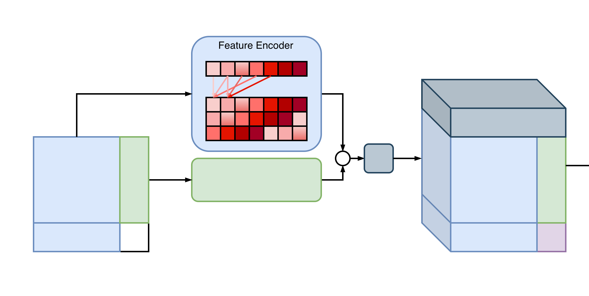

# Repeated Feature Grouping



The idea comes from the [TabICLv2](https://arxiv.org/abs/2602.11139) architecture (Qu et al., 2026), and the implementation is adapted from [nanotabicl](https://github.com/soda-inria/nanotabicl/blob/979f4a91af579cf30e17b58f48f097a4f4c95f4e/model.py#L38).

TabICLv2 states that **embedding each feature independently can cause representation collapse when features share similar distributions**. Repeated feature grouping places each feature into multiple groups via circular shifts while preserving the number of effective features. The shift pattern (0, 1, 3) is chosen so that for tables with ≥7 columns, no pair of columns ever appears together in more than one group.

Only the median run's log is included here. The median run is the one added to the general record table.

```
mean               2.28m    87     1.59s      5539      15.87m
std                0.52m    21     0.07s      1354      3.93m
median             2.15m    80     1.61s      5120      14.13m
-----------------  -------  -----  ---------  --------  -------  ---------------------
##  #   hostname   in mins  epoch  μ epoch t  datasets  runtime  id-name
--  --  ---------  -------  -----  ---------  --------  -------  ---------------------
1   23  dlc2gpu05  1.72m    62     1.67s      3968      11.00m   a9fbfbef-featuregroup
2   20  dlc2gpu05  1.73m    67     1.55s      4288      11.91m   8813e335-featuregroup
3   24  dlc2gpu05  1.77m    67     1.58s      4288      11.90m   c7ff6cc7-featuregroup
4   11  dlc2gpu01  1.80m    67     1.61s      4288      12.13m   fe546656-featuregroup
5   10  dlc2gpu01  1.81m    67     1.62s      4288      12.09m   5b2b8879-featuregroup
6   12  dlc2gpu05  1.81m    67     1.62s      4288      11.89m   0031ef2a-featuregroup
7   9   dlc2gpu08  1.83m    67     1.64s      4288      13.29m   d023a626-featuregroup
8   5   dlc2gpu08  1.83m    67     1.64s      4288      12.27m   929700cd-featuregroup
9   13  dlc2gpu01  1.84m    68     1.63s      4352      12.87m   33caad21-featuregroup
10  15  dlc2gpu07  1.85m    68     1.63s      4352      13.69m   09290a87-featuregroup
11  7   dlc2gpu07  1.87m    68     1.65s      4352      13.75m   4f66c7a2-featuregroup
12  22  dlc2gpu05  1.89m    68     1.67s      4352      12.24m   3ecba677-featuregroup
13  27  dlc2gpu05  1.91m    69     1.66s      4416      12.17m   fff3678c-featuregroup
14  29  dlc2gpu05  1.99m    72     1.66s      4608      12.64m   a6b16b63-featuregroup
15  21  dlc2gpu05  2.02m    80     1.51s      5120      14.13m   2398411e-featuregroup
16  18  dlc2gpu05  2.15m    78     1.65s      4992      13.79m   1686dd83-featuregroup
17  28  dlc2gpu05  2.19m    93     1.41s      5952      16.32m   86500795-featuregroup
18  14  dlc2gpu05  2.22m    83     1.60s      5312      16.24m   4d4f9b06-featuregroup
19  25  dlc2gpu05  2.26m    84     1.62s      5376      14.73m   2c8b95d8-featuregroup
20  2   dlc2gpu08  2.41m    88     1.64s      5632      17.08m   19b2bccd-featuregroup
21  30  dlc2gpu05  2.55m    96     1.59s      6144      16.73m   4e7503e0-featuregroup
22  4   dlc2gpu05  2.56m    96     1.60s      6144      16.85m   92e18526-featuregroup
23  31  dlc2gpu05  2.59m    113    1.38s      7232      19.83m   c1e4453f-featuregroup
24  26  dlc2gpu05  2.64m    113    1.40s      7232      19.98m   68298777-featuregroup
25  6   dlc2gpu05  2.76m    106    1.56s      6784      21.03m   7a8df56a-featuregroup
26  3   dlc2gpu11  2.85m    109    1.57s      6976      19.43m   5d0ae2ab-featuregroup
27  8   dlc2gpu08  2.94m    111    1.59s      7104      21.65m   c4b31270-featuregroup
28  16  dlc2gpu07  2.95m    113    1.57s      7232      22.03m   c9307b2c-featuregroup
29  1   dlc2gpu08  3.11m    116    1.61s      7424      21.17m   6ec1002f-featuregroup
30  17  dlc2gpu08  3.21m    122    1.58s      7808      23.04m   93654955-featuregroup
31  19  dlc2gpu05  3.72m    138    1.62s      8832      24.18m   7c65c3df-featuregroup
```

Before, each feature column was embedded independently:
```python
self.linear_layer = nn.Linear(1, e)
x = x.unsqueeze(-1)  # [batch, rows, cols, 1]
```

Now, each column is embedded as a triplet `(x[j], x[j+1], x[j+3])` as `feature_group_size=3`:
```python
self.linear_layer = nn.Linear(3, e)
x = torch.stack([x[:, :, (idxs + (2**i - 1)) % n_cols] for i in range(3)], dim=-1)
```

`feature_group_size` hyperparameter is not optimized.
